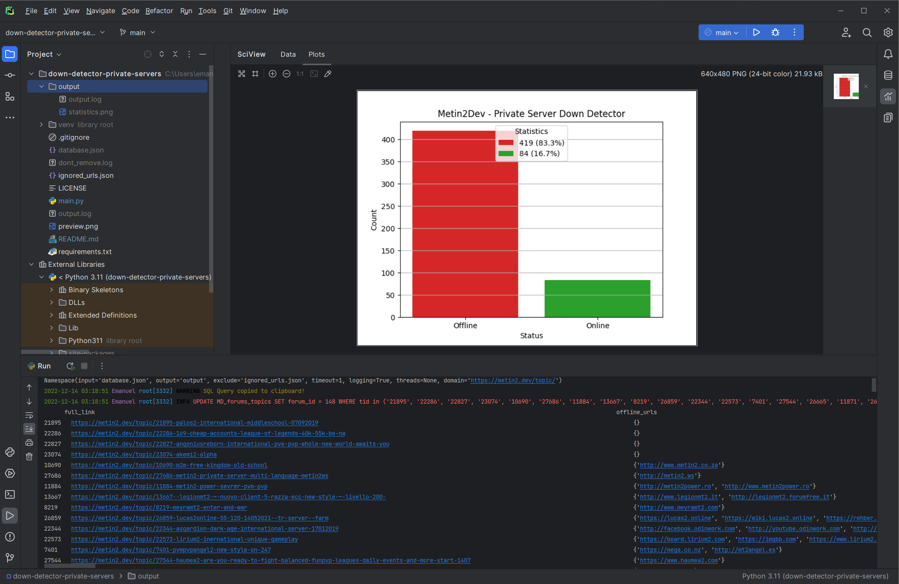

# Private Server Down Detector

This tool is scanning the entire `database.json` file, which contains all topics in the private servers category, along
with their associated content.\
The topic post is `HTML code` which is checked with a `regex` to find all valid hrefs links, as well as ignoring those
in the 'ignored urls.json' file to avoid making unnecessary requests.\
The links are then tested with a `HEAD request` to determine whether or not the server is online.\
This will allow us to get rid of the servers that are no longer operational and tidy up the relevant forum category.\
Topics without urls will be archived immediately.

<div style="text-align:center"></div>

The output features are still being worked on, but the tool is fully functional:
1. [x] Quickly generating a graph of the server statistics:
    + [x] Offline
    + [x] Online
    + [x] ~~Unknown (no urls)~~ **(TODO)**
2. [x] Generating a custom output file with the results of the scan.
3. [x] Constructing an automatic query to move offline servers to the archive category.

## How to use

[//]: # (Check if the website is down just for you or everyone around the globe.)

* Clone the repository

```git
git clone https://github.com/Metin2-Dev/down-detector-private-servers.git
```

* Install the latest version of [Python](https://www.python.org/downloads/), 3.11 or higher.


* Install virtual environment:

```bash
# Install virtualenv
py -3 -m venv venv

# Activate virtualenv (Windows)
./venv/scripts/activate

# Activate virtualenv (Linux)
source ./venv/bin/activate

# Install the requirements
pip install -r requirements.txt
```

# Available command line arguments (optional)

* `--version` - Show the version of the script
* `--help`    - Show help message with available arguments


* `--input`   - JSON database file `default: database.json`
* `--output`  - Output path directory `default: ./output`
* `--exclude` - JSON excluded urls file `default: ignored_urls.json`
* `--timeout` - Timeout for HTTP requests `default: None` (wait until the request is finished)
* `--logging` - Enable console output `default = True`
* `--domain`  - URL of the topic forum's domain ``default = https://forum.metin2.dev/topic/``
* `--threads` - The maximum number of threads that can be used `default = None` (all available threads)

Run the script via the command line:

```bash
python main.py --input ./database.json
```
`Namespace(input='database.json', output='output', exclude='ignored_urls.json', timeout=None, logging=False, threads=None, domain='https://metin2.dev/topic/')`

You can also run the script from your preferred IDE, such as 
[PyCharm ](https://www.jetbrains.com/pycharm/)
or
[**VSCode** ](https://code.visualstudio.com/)
and it will use the default arguments.


# How to contribute

* Fork the repository
* Create a new branch
* Make your changes
* Create a pull request
* Wait for the review

# Author

Vegas007
[](https://github.com/Vegas007)

# License

[](https://opensource.org/licenses/MIT)